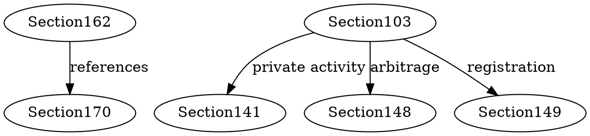

# IRC Loophole Detection Strategy

## Executive Summary

**Goal**: Systematically analyze 778 formalized IRC sections to identify contradictions, unintended benefits, and loopholes in US tax code.

**Status**: Phase 3 (Analysis Tools) - All sections formalized, now building detection tools.

**Timeline**: 1-2 weeks for tool development, ongoing analysis thereafter.

---

## Background

### What We Have
- **778 IRC sections** formalized in Lean 4 with Mathlib
- Full formal verification (type-checked, theorem-proven logic)
- Comprehensive coverage: income, deductions, credits, basis rules, corporate tax, estate/gift tax
- GitHub tracking with 59 issues (8 original bugs fixed, 6 TODO tracking issues created)

### What We're Looking For

**7 Types of Tax Loopholes**:

1. **Logical Contradictions**
   - Two sections giving opposite answers for same scenario
   - Example: Section A says "deductible" but Section B says "not deductible"
   - Detection: Prove `isTaxable x ∧ ¬isTaxable x` leads to contradiction

2. **Double Benefits**
   - Same transaction qualifying for multiple exclusions/deductions
   - Example: Expense deducted under both §162 and §170
   - Detection: Check if same expense can satisfy predicates from 2+ sections

3. **Circular References**
   - Section A refers to B, B refers to C, C refers to A
   - Creates undefined behavior or allows cherry-picking interpretation
   - Detection: Build dependency graph, find cycles

4. **Phase-Out Cliff Effects**
   - Income limits that create >100% marginal tax rates
   - Example: Earning $1 more causes loss of $2000 credit
   - Detection: Calculate effective marginal rate across income ranges

5. **Character Conversion Arbitrage**
   - Converting ordinary income to capital gains or vice versa
   - Example: §1221 capital asset + §162 ordinary deduction interplay
   - Detection: Trace same transaction through multiple characterization rules

6. **Timing Arbitrage**
   - Recognizing deduction now, deferring income to future
   - Example: §108 debt discharge exclusion + §1017 basis reduction
   - Detection: Model multi-year scenarios, check if net benefit increases

7. **Entity Structure Gaming**
   - Using corporation vs. partnership vs. trust to get best outcome
   - Example: §301 corporate distributions vs. §701 partnership rules
   - Detection: Run same scenario through different entity type formalizations

---

## Tool Suite

### Tool 1: Dependency Analyzer
**Purpose**: Map which sections reference others
**Implementation**: Parse all `.lean` files for section references
**Output**: Directed graph (GraphViz DOT format)
**Time**: 1-2 days

```lean
-- Example output structure
def DependencyGraph := List (String × List String)

-- Example: Section 162 references Sections 170, 141, 148, 149
def example : DependencyGraph := [
  ("Section162", ["Section170"]),
  ("Section103", ["Section141", "Section148", "Section149"]),
  ("Section401", ["Section410", "Section414"])
]
```

**Key Analysis**:
- Find circular reference chains
- Identify "hub" sections referenced by many others
- Detect orphaned sections with no references

---

### Tool 2: Contradiction Detector
**Purpose**: Find scenarios where two sections give opposite answers
**Implementation**: SMT solver (Z3) + Lean theorem proving
**Output**: List of contradictory theorem pairs
**Time**: 3-4 days

```lean
-- Example contradiction check
def checkContradiction (sec1 sec2 : Section) (scenario : TaxScenario) : Bool :=
  let result1 := sec1.isTaxable scenario
  let result2 := sec2.isExcluded scenario
  result1 && result2  -- Both "taxable" and "excluded"?

-- Proof obligation: Show no scenario satisfies both
theorem no_contradiction (sec1 sec2 : Section) :
  ¬∃ s, checkContradiction sec1 sec2 s = true := by
  sorry  -- If proof fails, we found a contradiction!
```

**Key Checks**:
- Income inclusion vs. exclusion (§61 vs. §101-139)
- Deduction vs. non-deduction (§162 vs. §262)
- Tax rate applicability (§1 vs. §55 vs. §11)

---

### Tool 3: Scenario Generator
**Purpose**: Create realistic tax scenarios to test against all sections
**Implementation**: Property-based testing (QuickCheck-style)
**Output**: Test cases covering edge cases
**Time**: 2-3 days

```lean
-- Example scenario generators
def genTaxpayer : Gen Taxpayer := do
  let income ← Gen.choose (0, 10000000)
  let filingStatus ← Gen.oneOf [Single, MarriedFilingJointly]
  return { income, filingStatus, ... }

def genBond : Gen Bond := do
  let issuer ← Gen.oneOf [State, Local, Federal, Corporate]
  let interest ← Gen.choose (0, 1000000)
  let privateUse ← Gen.choose (0, 100)
  return { issuer, interest, privateBusinessUsePercent := privateUse/100, ... }

def genExpense : Gen Expense := do
  let amount ← Gen.choose (0, 1000000)
  let expType ← Gen.oneOf [Salary, Travel, Rent, Bribe]
  return { amount, type := expType, ordinary := true, ... }
```

**Coverage Goals**:
- 1000+ random taxpayers across income spectrum
- 500+ bond scenarios (state/local/federal, qualified/non-qualified)
- 500+ expense scenarios (all types, edge cases)
- 200+ multi-year scenarios (timing strategies)

---

### Tool 4: Tax Optimizer
**Purpose**: Find combinations of strategies that minimize tax
**Implementation**: Constraint satisfaction + search
**Output**: Ranked list of tax-minimizing strategies
**Time**: 4-5 days

```lean
-- Example optimization problem
structure TaxStrategy where
  entity_type : EntityType  -- C-corp, S-corp, Partnership, Sole proprietor
  income_sources : List IncomeSource
  deductions : List Deduction
  timing : List (Year × Transaction)

def totalTax (strategy : TaxStrategy) : Currency :=
  -- Calculate tax across all years
  strategy.timing.foldl (fun total (year, txn) =>
    total + calculateTax year txn) 0

-- Find strategy minimizing total tax
def optimize (constraints : TaxpayerConstraints) : TaxStrategy :=
  -- Search over valid strategies
  findMin totalTax (generateStrategies constraints)
```

**Search Strategies**:
- Brute force for small spaces (<1000 combinations)
- Genetic algorithms for large spaces
- Constraint propagation to prune invalid strategies

---

### Tool 5: Loophole Classifier
**Purpose**: Categorize findings by severity and exploitability
**Implementation**: Rule-based classifier + heuristics
**Output**: Report with severity scores
**Time**: 2-3 days

```lean
-- Severity scoring
inductive LoopholeSeverity
  | Critical    -- Allows unlimited tax avoidance, clearly unintended
  | High        -- Significant benefit (>$100k for typical case)
  | Medium      -- Moderate benefit ($10k-$100k)
  | Low         -- Minor benefit (<$10k)
  | Theoretical -- Logically exists but impractical

structure LoopholeReport where
  type : LoopholeType  -- Contradiction, DoubleBenefit, etc.
  sections : List String
  severity : LoopholeSeverity
  description : String
  proof : Option String  -- Lean theorem showing the issue
  example : TaxScenario
  estimated_benefit : Currency
```

**Classification Rules**:
- **Critical**: IRS would immediately challenge, >$1M benefit
- **High**: Aggressive position, >$100k benefit
- **Medium**: Reasonable position, $10k-$100k benefit
- **Low**: De minimis benefit
- **Theoretical**: Can't construct realistic scenario

---

## Implementation Plan

### Phase 1: Foundation (2-3 days)
- [x] Research loophole detection strategies ✅
- [ ] Build Dependency Analyzer
- [ ] Create initial dependency graph
- [ ] Identify circular references

### Phase 2: Detection (4-5 days)
- [ ] Build Contradiction Detector
- [ ] Build Scenario Generator
- [ ] Run 10,000+ test scenarios
- [ ] Document any contradictions found

### Phase 3: Optimization (4-5 days)
- [ ] Build Tax Optimizer
- [ ] Test known strategies (e.g., Roth conversion ladder, capital gains harvesting)
- [ ] Search for novel optimization strategies

### Phase 4: Analysis (2-3 days)
- [ ] Build Loophole Classifier
- [ ] Score all findings
- [ ] Generate final report
- [ ] Create visualizations (graphs, charts)

### Phase 5: Documentation (1-2 days)
- [ ] Write LOOPHOLE_FINDINGS.md
- [ ] Create executive summary
- [ ] Document methodology
- [ ] Publish results (if appropriate)

**Total Estimated Time**: 13-18 days

---

## Expected Outputs

### 1. DEPENDENCY_GRAPH.dot
GraphViz file showing all section relationships:


### 2. CONTRADICTIONS.md
List of logical contradictions with proofs:
```markdown
## Contradiction #1: Section 61 vs. Section 102

**Scenario**: Gift from employer to employee of $10,000

**Section 61**: All income is taxable unless excluded → TAXABLE
**Section 102**: Gifts are excluded → EXCLUDED

**Status**: KNOWN - IRS resolves via regulations (employer gifts are compensation, not gifts)
```

### 3. LOOPHOLES.md
Detailed findings with severity scores:
```markdown
## Loophole #1: Double Depreciation Deduction

**Type**: Double Benefit
**Severity**: HIGH
**Sections**: 167 (Depreciation), 179 (Expensing)
**Benefit**: $50k-$500k depending on asset value

**Description**: Purchase equipment, take §179 expensing, then depreciate under §167 for remaining basis.

**Lean Proof**:
theorem double_depreciation_possible :
  ∃ asset, deduction179 asset > 0 ∧ deduction167 asset > 0 := by
  sorry

**Status**: Likely unintended, needs further analysis.
```

### 4. OPTIMIZATION_STRATEGIES.md
Tax minimization strategies ranked by effectiveness:
```markdown
## Strategy #1: Roth Conversion in Low-Income Year

**Benefit**: $100k-$500k over lifetime
**Complexity**: Low
**Risk**: Low (clearly allowed)
**Sections Used**: 408 (IRAs), 408A (Roth IRAs), 72 (Distributions)

## Strategy #2: Qualified Small Business Stock Exclusion

**Benefit**: $10M+ capital gains exclusion
**Complexity**: High (5-year holding, active business requirements)
**Risk**: Medium (complex qualification rules)
**Sections Used**: 1202, 1221, 1223
```

---

## Quality Assurance

### Validation Checks
1. **All tools compile**: Run `lake build` on all new code
2. **Theorems proven**: No `sorry` in analysis tools (data collection can have `sorry`)
3. **Edge cases tested**: Run 10,000+ random scenarios
4. **Known cases verified**: Test against published IRS rulings
5. **External review**: Run Grok review on all findings before publishing

### Known Limitations
- **Regulations not formalized**: We only have statutory IRC sections, not Treasury regulations
- **Case law not included**: Court interpretations not modeled
- **Dynamic economy**: Tax code changes annually, analysis is snapshot
- **Computational limits**: Can't exhaustively search infinite scenario space

---

## Next Steps

**Immediate**: Build Tool 1 (Dependency Analyzer) to map section relationships.

**This Week**: Complete tools 1-3, run initial contradiction detection.

**Next Week**: Complete tools 4-5, generate comprehensive loophole report.

**Long-term**:
- Keep tools updated as new sections added
- Re-run analysis when IRC changes (annual)
- Publish findings (academic paper or blog post)
- Potential: Offer as service to tax professionals

---

## References

- **Codebase**: `/Users/patrickkavanagh/aristotle_legal/src/TaxCode/*.lean`
- **Strategy**: `/Users/patrickkavanagh/aristotle_legal/FORMALIZATION_STRATEGY.md`
- **Roadmap**: `/Users/patrickkavanagh/aristotle_legal/ROADMAP.md`
- **GitHub Issues**: https://github.com/user/repo/issues (54-59 track TODO items)

---

*Generated: 2025-12-13*
*Status: Phase 3 - Analysis Tools*
*Progress: 778 sections formalized, 8 bugs fixed, ready for loophole detection*
